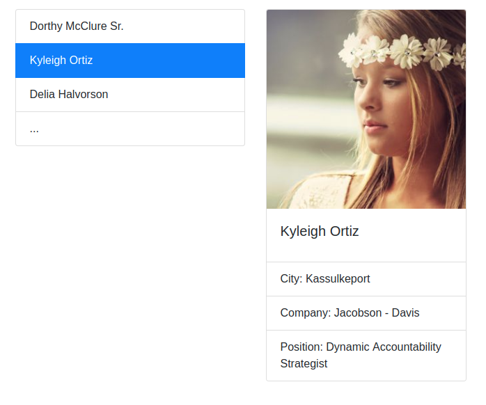

# HOC — Hooks & Context API

[](https://ci.appveyor.com/project/RomanMenshikov92/ra-16-react-hooks-context-api)

[](https://github.com/RomanMenshikov92/ra-16-react-hooks-context-api/actions/workflows/pages/pages-build-deployment)

---

## [GutHub Pages](https://romanmenshikov92.github.io/ra-16-react-hooks-context-API/)

Необходимо выполнить и предоставить на проверку следующие задачи:

<details>
<summary>1. Список и детали</summary>

# Список и детали

Вы решили потренироваться в использовании хука `useEffect` и реализовать следующее приложение — список с пользователями, в котором при клике на пользователя рядом появляется окно, отображающее детальную информацию о нём:



При первой загрузке ни один из элементов не выбран, поэтому отображается только список:


## Механика

Назовём первый компонент слева `List`, а второй справа — `Details`.

Реализуйте следующую логику:

- При загрузке приложения один раз делается запрос по адресу https://raw.githubusercontent.com/netology-code/ra16-homeworks/master/hooks-context/use-effect/data/users.json и отрисовывается список в компоненте `List`.
- При клике на конкретный элемент списка в компонент `Details` передаётся один props: `info` (объект с полями `id` и `name`) и начинается загрузка данных по адресу: https://raw.githubusercontent.com/netology-code/ra16-homeworks/master/hooks-context/use-effect/data/{id}.json, где {id} — это ID пользователя из props.
- На время загрузки можете отображать индикатор загрузки. Протестируйте с помощью выставления ограничения пропускной способности сети в Dev Tools.

Важные моменты:

1. Вся загрузка должна происходить через хук `useEffect`. Подумайте, как организовать единоразовую загрузку и загрузку при каждом изменении `props.info.id`.
1. Обратите внимание, загрузка деталей должна происходить только при изменении `props.info.id`, а не при каждом рендере. То есть если на одного и того же пользователя кликнуть дважды, то загрузка произойдёт только в первый раз.

</details>

<details>
<summary>2. UseJsonFetch</summary>

# UseJsonFetch

Реализуйте кастомный хук `useJsonFetch`, который позволяет с помощью `fetch` осуществлять HTTP-запросы.

Использование этого хука должно выглядеть следующим образом:

```javascript
const [data, loading, error] = useJsonFetch(url, opts);
```

где:

- `data` — данные, полученные после `response.json()`, не Promise, а именно данные;
- `error` — ошибка: ошибка сети, ошибка ответа, если код не 20x, ошибка парсинга, если пришёл не JSON;
- `loading` — boolean флаг, сигнализирующий о том, что загрузка идёт.

Покажите использование этого хука на примере трёх компонентов, каждый из которых делает запросы на следующие адреса:

- GET http://localhost:7070/data — успешное получение данных;
- GET http://localhost:7070/error — получение 500 ошибки;
- GET http://localhost:7070/loading — индикатор загрузки.

Backend возьмите из каталога `backend`.

</details>

<details>
<summary>3. Authentication (необязательная задача)</summary>

# Authentication

Вы решили построить систему с аутентификацией.

Используя сервер, расположенный в каталоге `backend`, реализуйте приложение, удовлетворяющее следующим условиям:

1. При первой загрузке показывается лэндинг с формой входа:


2. После авторизации (POST http://localhost:7070/auth `{"login": "vasya", "password": "password"}`) загружаются компоненты ленты новостей и в тулбаре отображается профиль с кнопкой «Выйти»:


Для запроса профиля используйте запрос вида:

```
GET http://localhost:7070/private/me
Authorization: Bearer <ваш_токен>
```

Для запроса новостей используйте запрос вида:

```
GET http://localhost:7070/private/news
Authorization: Bearer <ваш_токен>
```

Важно:

1. Профиль и токен должны храниться в localStorage/sessionStorage. При перезагрузке страницы должна также загружаться лента новостей, если мы аутентифицированы.
1. Должна быть обработка ошибок, если получена ошибка 401, то нужно разлогинивать пользователя — удалять всё из localStorage/sessionStorage.
1. Не используйте React Router, просто подменяйте компоненты в зависимости от текущего состояния аутентификации.

</details>

---

Любые вопросы по решению задач задавайте в группе в Discord.

Все три задачи лучше сдавать в разных репозиториях, то есть через create-react-app реализовать три проекта, чтобы не было конфликта стилей. Но если вы позаботитесь о том, что конфликта не будет, то можете сдавать и в одном проекте.

Обратите внимание: в файлах App.js расположено несколько компонентов не потому, что так нужно делать, а чтобы вам было удобнее копировать. Будет хорошо, если в своём решении вы разнесёте их по разным файлам.

#### Альтернативный способ создания приложения React с использованием тулинга Vite

Приложение также можно создать используя инструмент Vite.
Документация по созданию приложения [React](https://vitejs.dev/guide/).

1. Откройте терминал и пропишите следующую команду: `yarn create vite my-app --template react`,
   либо `yarn create vite my-app --template react-ts`, если
   нужен шаблон с TypeScript. Эта команда создаст настроенный
   шаблонный проект.
2. Откройте созданный проект в своей IDE.
3. Установите зависимости.
4. Готово. Чтобы запустить приложение, введите команду: `yarn dev`(либо `npm run dev`).
